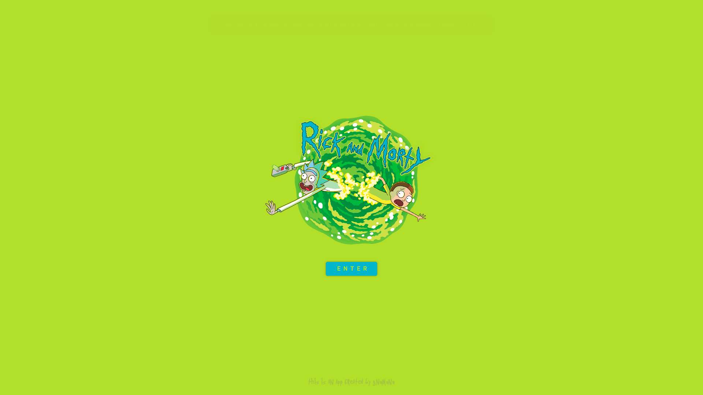

# React + Vite + Redux + Sass

## Vite:  
https://vitejs.dev/

    npm create vite@latest 
        ► Project-name: front-test-6-vite-sass
        ► React
        ► JavaScript

## Sass:  
https://sass-lang.com/

    npm add -D sass

## Normalize
https://necolas.github.io/normalize.css/

    npm i normalize.css

## React Router Dom:  
https://reactrouter.com/en/main/

    npm i react-router-dom

## axios: 
https://axios-http.com/docs/intro/

    npm i axios

